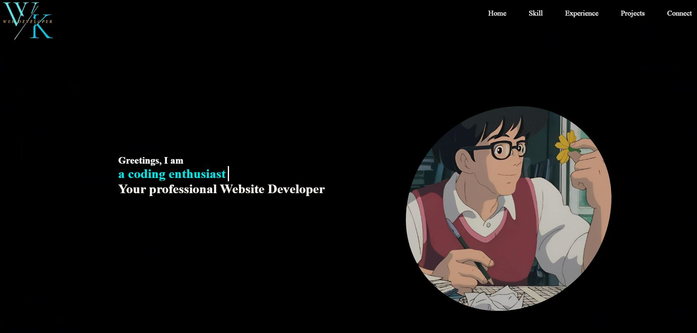

# Personal Portfolio — Lim Wei Keong

>Personal portfolio website built with HTML, CSS &amp; JavaScript. Features a responsive layout, animated timeline, skill progress bars, project showcase, and a contact form.


---

## Live Demo

**[weikeong12.github.io/personal-portfolio](https://weikeong12.github.io/personal-portfolio)**

---

## Preview

| Home | About | Skills |
|------|-------|--------|
|  | Animated timeline | Progress bars |

---

## Project Structure

```
personal-portfolio/
│
├── home.html          # Landing page with typing animation
├── about.html         # Timeline of education & experience
├── skill.html         # Skills & tools with progress bars
├── project.html       # Project showcase grid
├── connect.html       # Contact form & social links
│
├── shared.css         # Global styles, navbar, cursor
├── shared.js          # Shared navbar & cursor logic
│
├── home.css / home.js
├── about.css / about.js
├── skill.css / skill.js
├── project.css / project.js
├── connect.css / connect.js
│
└── images/            # All image assets
```

---

## Features

- **Responsive Design** — Mobile, tablet, and desktop friendly
- **Custom Cursor** — Smooth animated cursor with hover effects
- **Typing Animation** — Auto-typing name effect on the home page
- **Animated Timeline** — Scroll-triggered education & career timeline
- **Skill Progress Bars** — Animated bars triggered on scroll into view
- **Project Showcase** — Hover overlays with tech stack and links
- **3D Globe** — CSS 3D rotating globe on the connect page
- **Contact Form** — Clean form with submit feedback state
- **Social Links** — Instagram, Facebook, LinkedIn, Telegram, Discord

---

## Technologies Used

| Technology | Purpose |
|---|---|
| HTML5 | Page structure & semantics |
| CSS3 | Styling, animations, responsive layout |
| JavaScript (ES6+) | Interactivity, typing effect, scroll animations |
| CSS Grid & Flexbox | Responsive layouts |
| IntersectionObserver API | Scroll-triggered animations |
| Google Fonts | Typography (Space Grotesk + Syne) |
| CSS Custom Properties | Theming and design tokens |

---

## Getting Started

### View Locally

1. **Clone the repository**
   ```bash
   git clone https://github.com/WeiKeong12/personal-portfolio.git
   ```

2. **Navigate into the folder**
   ```bash
   cd personal-portfolio
   ```

3. **Open in browser**
   ```bash
   # Simply open home.html in any modern browser
   open home.html
   ```
   Or use the **Live Server** extension in VS Code for best results.

---

## Pages Overview

### Home
Entry point with a full-screen hero section, animated typing effect cycling through name and roles, profile image, and a stats bar.

### About
Personal introduction with a profile photo, followed by a vertically animated timeline detailing education and career milestones from 2018 to present.

### Skills
Divided into two sections — **Tools Used** (VS Code, GitHub, P5.js) and **Languages & Competency** with animated progress bars for JavaScript, C++, CSS, Python, Bootstrap, HTML, PHP, and C#.

### Projects
A responsive 3-column grid showcasing 6 projects including a 2D retro game, data visualisation tool, rhyming assistant, e-commerce platform, and movie streaming site. Each card reveals tech stack and a project link on hover.

### Connect
Features a CSS 3D rotating globe, floating social media icons, and a clean contact form with name, email, and message fields.

---

## Responsive Breakpoints

| Breakpoint | Layout |
|---|---|
| > 960px | Full desktop layout |
| 768px – 960px | Tablet — stacked sections |
| < 768px | Mobile — hamburger nav, single column |
| < 480px | Small mobile — compact spacing |

---

## Design System

```css
--cyan:     rgb(10, 206, 241)   /* Primary accent */
--bg-dark:  #090c10             /* Page background */
--bg-card:  rgba(255,255,255,0.04)  /* Card surfaces */
--text-white: #f0f4f8           /* Primary text */
--text-muted: #8a9bb0           /* Secondary text */
```

**Fonts:** [Space Grotesk](https://fonts.google.com/specimen/Space+Grotesk) (body) + [Syne](https://fonts.google.com/specimen/Syne) (headings)

---

## Customisation

To personalise this portfolio for your own use:

1. Replace images in the `images/` folder with your own
2. Update name, bio, and email in `home.html` and `about.html`
3. Edit timeline entries in `about.html`
4. Update skill percentages in `skill.html`
5. Replace project images and descriptions in `project.html`
6. Update social media links in `connect.html`

---

## License

This project is licensed under the **MIT License** — see the [LICENSE](LICENSE) file for details.

You are free to use, copy, modify, and distribute this project with attribution.

---

## Author

**Lim Wei Keong**

- GitHub: [@WeiKeong12](https://github.com/WeiKeong12)
- Email: weikeonglim999@yahoo.com.sg

---

> *"Ambitious and driven, committed to staying at the forefront of the tech industry."*
